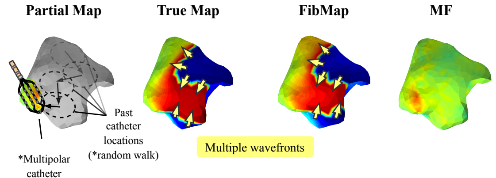

---

##### Download

+ [Paper](paper1.pdf)

---

##### Abstract

Catheter ablation of Atrial Fibrillation (AF) consists of a one-size-fits-all treatment with limited success in persistent AF. This may be due to our inability to map the dynamics of AF with the limited resolution and coverage provided by sequential contact mapping catheters, preventing effective patient phenotyping for personalised, targeted ablation. Here we introduce FibMap, a graph recurrent neural network model that reconstructs global AF dynamics from sparse measurements. Trained and validated on 51 non-contact whole atria recordings, FibMap reconstructs whole atria dynamics from 10% surface coverage, achieving a 210% lower mean absolute error and an order of magnitude higher performance in tracking phase singularities compared to baseline methods. Clinical utility of FibMap is demonstrated on real-world contact mapping recordings, achieving reconstruction fidelity comparable to non-contact mapping. FibMap's state-spaces and patient-specific parameters offer insights for electrophenotyping AF. Integrating FibMap into clinical practice could enable personalised AF care and improve outcomes.

---

##### Example reconstructions using FibMap (our algorithm)



---
##### Presentation



---

##### Citation

Jenkins, Alexander & Cini, Andrea & Barker, Joseph & Sharp, Alexander & Sau, Arunashis & Valentine, Varun & Valasang, Srushti & Li, Xinyang & Wong, Tom & Betts, Tim & Mandic, Danilo & Alippi, Cesare & Ng, Fu. (2025). Learning to Predict Global Atrial Fibrillation Dynamics from Sparse Measurements. 10.48550/arXiv.2502.09473.

```BibTeX
@misc{jenkins2025learningpredictglobalatrial,
      title={Learning to Predict Global Atrial Fibrillation Dynamics from Sparse Measurements}, 
      author={Alexander Jenkins and Andrea Cini and Joseph Barker and Alexander Sharp and Arunashis Sau and Varun Valentine and Srushti Valasang and Xinyang Li and Tom Wong and Timothy Betts and Danilo Mandic and Cesare Alippi and Fu Siong Ng},
      year={2025},
      eprint={2502.09473},
      archivePrefix={arXiv},
      primaryClass={cs.LG},
      url={https://arxiv.org/abs/2502.09473}, 
}
```