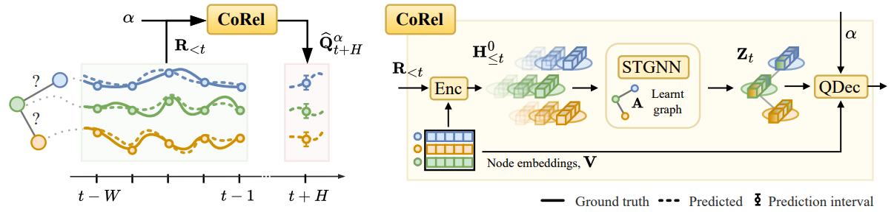

##### Download

+ [Paper](paper2.pdf)
+ [Code and data](https://github.com/andreacini/corel)

---

##### Abstract

We address the problem of uncertainty quantification in time series forecasting by exploiting observations at correlated sequences. Relational deep learning methods leveraging graph representations are among the most effective tools for obtaining point estimates from spatiotemporal data and correlated time series. However, the problem of exploiting relational structures to estimate the uncertainty of such predictions has been largely overlooked in the same context. To this end, we propose a novel distribution-free approach based on the conformal prediction framework and quantile regression. Despite the recent applications of conformal prediction to sequential data, existing methods operate independently on each target time series and do not account for relationships among them when constructing the prediction interval. We fill this void by introducing a novel conformal prediction method based on graph deep learning operators. Our approach, named Conformal Relational Prediction (COREL), does not require the relational structure (graph) to be known a priori and can be applied on top of any pre-trained predictor. Additionally, COREL includes an adaptive component to handle non-exchangeable data and changes in the input time series. Our approach provides accurate coverage and achieves state-of-the-art uncertainty quantification in relevant benchmarks.

---

##### Overview: Past residuals are used as input to a hybrid global-local graph-based quantile network.



---

##### Citation

Cini, A., Jenkins, A., Mandic, D., Alippi, C., & Bianchi, F. M. (2025). Relational Conformal Prediction for Correlated Time Series. International Conference on Machine Learning.

```BibTeX
@article{cini2025relational,
title        = {{Relational Conformal Prediction for Correlated Time Series}},
author       = {Cini, Andrea and Jenkins, Alexander and Mandic, Danilo and Alippi, Cesare and Bianchi, Filippo Maria},
journal      = {International Conference on Machine Learning},
year         = {2025}
}
```

