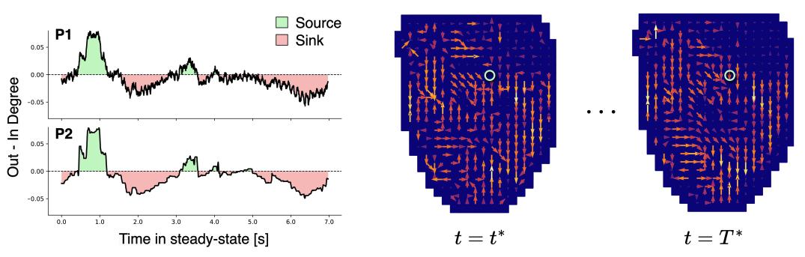

---

##### Download

+ [Paper](paper3.pdf)
+ [Code and data](https://github.com/jenkins-alex/AdaCGP)

---

##### Abstract

Graph Signal Processing (GSP) provides a powerful framework for analysing complex, interconnected systems by modelling data as signals on graphs. Recent advances in GSP have enabled the learning of graph structures from observed signals, but these methods often struggle with time-varying systems and real-time applications. Adaptive filtering techniques, while effective for online learning, have seen limited application in graph topology estimation from a GSP perspective. To this end, we introduce AdaCGP, an online algorithm for adaptive estimation of the Graph Shift Operator (GSO) from multivariate time series. The GSO is estimated from an adaptive time-vertex autoregressive model through recursive update formulae designed to address sparsity, shift-invariance and bias. Through simulations, we show that AdaCGP performs consistently well across various graph topologies, and achieves improvements in excess of 82% for GSO estimation compared to baseline adaptive vector autoregressive models. In addition, our online variable splitting approach for enforcing sparsity enables near-perfect precision in identifying causal connections while maintaining low false positive rates upon optimisation of the forecast error. Finally, AdaCGP's ability to track changes in graph structure is demonstrated on recordings of ventricular fibrillation dynamics in response to an anti-arrhythmic drug. AdaCGP is shown to be able to identify the stability of critical conduction patterns that may be maintaining the arrhythmia in an intuitive way, together with its potential to support diagnosis and treatment strategies.

---

##### Example: Online graph learning via AdaCGP for analysis of cardiac fibrillation dynamics



---

##### Citation

Jenkins, A., Variddhisai, T., El-Medany, A., Ng, F. S., & Mandic, D. (2024). Online Graph Learning via Time-Vertex Adaptive Filters: From Theory to Cardiac Fibrillation. arXiv [Eess.SP]. Retrieved from http://arxiv.org/abs/2411.01567

```BibTeX
@misc{jenkins2024onlinegraphlearningtimevertex,
      title={Online Graph Learning via Time-Vertex Adaptive Filters: From Theory to Cardiac Fibrillation}, 
      author={Alexander Jenkins and Thiernithi Variddhisai and Ahmed El-Medany and Fu Siong Ng and Danilo Mandic},
      year={2024},
      eprint={2411.01567},
      archivePrefix={arXiv},
      primaryClass={eess.SP},
      url={https://arxiv.org/abs/2411.01567}, 
}
```