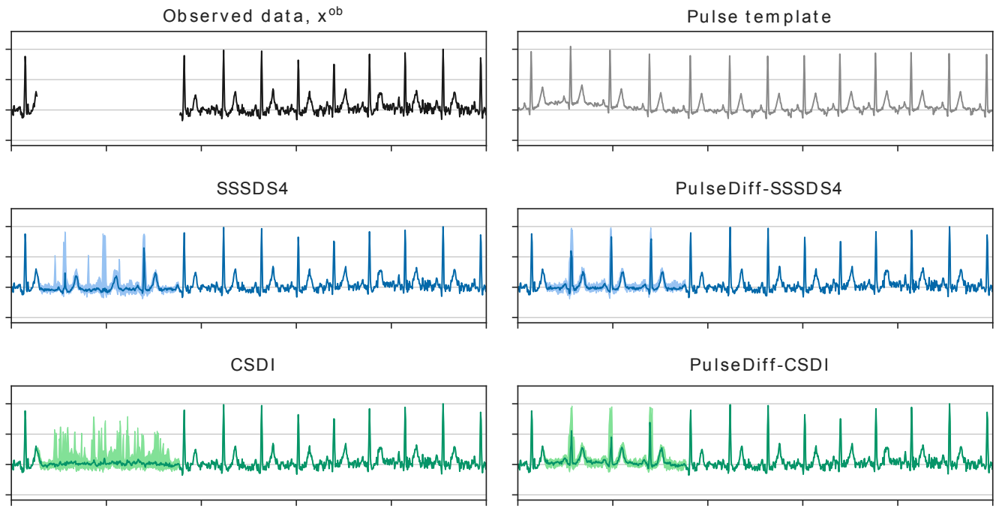

---

##### Download

+ [Paper](paper4.pdf)

---

##### Abstract

Pulsative signals such as the electrocardiogram (ECG) are extensively collected as part of routine clinical care. However, noisy and poor-quality recordings are a major issue for signals collected using mobile health systems, decreasing the signal quality, leading to missing values, and affecting automated downstream tasks. Recent studies have explored the imputation of missing values in ECG with probabilistic time-series models. Nevertheless, in comparison with the deterministic models, their performance is still limited, as the variations across subjects and heart-beat relationships are not explicitly considered in the training objective. In this work, to improve the imputation and forecasting accuracy for ECG with probabilistic models, we present a template-guided denoising diffusion probabilistic model (DDPM), PulseDiff, which is conditioned on an informative prior for a range of health conditions. Specifically, 1) we first extract a subject-level pulsative template from the observed values to use as an informative prior of the missing values, which personalises the prior; 2) we then add beat-level stochastic shift terms to augment the prior, which considers variations in the position and amplitude of the prior at each beat; 3) we finally design a confidence score to consider the health condition of the subject, which ensures our prior is provided safely. Experiments with the PTBXL dataset reveal that PulseDiff improves the performance of two strong DDPM baseline models, CSDI and SSSDS4, verifying that our method guides the generation of DDPMs while managing the uncertainty. When combined with SSSDS4, PulseDiff outperforms the leading deterministic model for short-interval missing data and is comparable for long-interval data loss.

---

##### Example: Improving diffusion-based ECG imputation with PulseDiff



---

##### Citation

Jenkins, A., Chen, Z., Ng, F. S., & Mandic, D. (2023). Improving Diffusion Models for ECG Imputation with an Augmented Template Prior. arXiv [Cs.LG]. Retrieved from http://arxiv.org/abs/2310.15742

```BibTeX
@misc{jenkins2023improvingdiffusionmodelsecg,
      title={Improving Diffusion Models for ECG Imputation with an Augmented Template Prior}, 
      author={Alexander Jenkins and Zehua Chen and Fu Siong Ng and Danilo Mandic},
      year={2023},
      eprint={2310.15742},
      archivePrefix={arXiv},
      primaryClass={cs.LG},
      url={https://arxiv.org/abs/2310.15742}, 
}
```