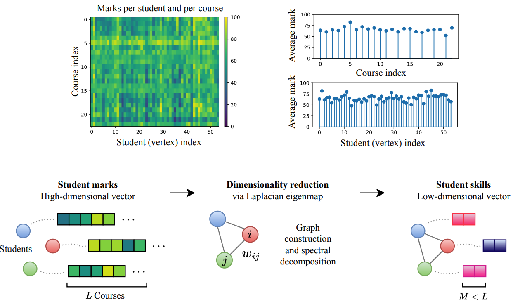

---

##### Download

+ [Paper](paper5.pdf)

---

##### Abstract

Forming the right combination of students in a group promises to enable a powerful and effective environment for learning and collaboration. However, defining a group of students is a complex task which has to satisfy multiple constraints. This work introduces an unsupervised algorithm for fair and skill-diverse student group formation. This is achieved by taking account of student course marks and sensitive attributes provided by the education office. The skill sets of students are determined using unsupervised dimensionality reduction of course mark data via the Laplacian eigenmap. The problem is formulated as a constrained graph partitioning problem, whereby the diversity of skill sets in each group are maximised, group sizes are upper and lower bounded according to available resources, and 'balance' of a sensitive attribute is lower bounded to enforce fairness in group formation. This optimisation problem is solved using integer programming and its effectiveness is demonstrated on a dataset of student course marks from Imperial College London.

---

##### Outline of our approach



---

##### Citation

Jenkins, A., Jaimoukha, I., Stankovic, L., & Mandic, D. (2023). Fair and skill-diverse student group formation via constrained k-way graph partitioning. arXiv [Cs.LG]. Retrieved from http://arxiv.org/abs/2301.09984

```BibTeX
@misc{jenkins2023fairskilldiversestudentgroup,
      title={Fair and skill-diverse student group formation via constrained k-way graph partitioning}, 
      author={Alexander Jenkins and Imad Jaimoukha and Ljubisa Stankovic and Danilo Mandic},
      year={2023},
      eprint={2301.09984},
      archivePrefix={arXiv},
      primaryClass={cs.LG},
      url={https://arxiv.org/abs/2301.09984}, 
}
```