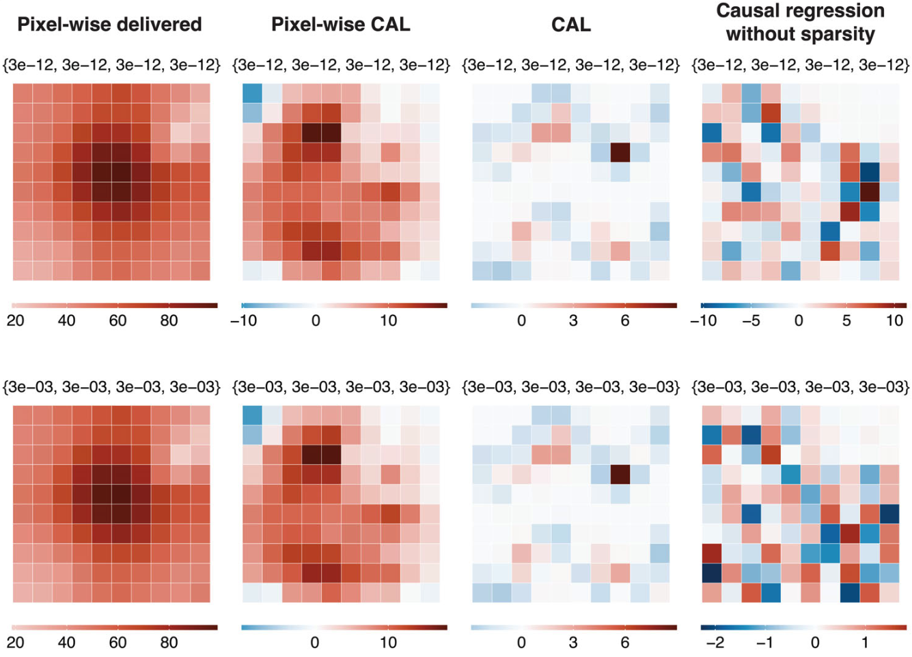

##### Download

+ [Paper](paper6.pdf)

---

##### Abstract

<b>Background</b>: Radiotherapy, the use of high-energy radiation to treat cancer, presents a challenge in determining treatment outcome relationships due to its complex nature. These challenges include its continuous, spatial, high-dimensional, multi-collinear treatment, and personalized nature, which introduces confounding bias.

<b>Purpose</b>: Existing voxel-based estimators may lead to biased estimates as they do not use a causal inference framework. We propose a novel estimator using sparsity via Adaptive Lasso within Pearl's causal framework, the Causal Adaptive Lasso (CAL).

<b>Methods</b>: First, simplified 2-dimensional treatment plans were simulated on 10 × 10 and 25 × 25 grids. Each simulation had an organ at risk placed in a consistent location where dose was minimized and a randomly placed target volume where dose was maximized. Treatment uncertainties were simulated to emulated a fractionated delivery. A directed acyclic graph was devised which captured the causal relationship between our outcome, including confounding. The estimand was set to the associated dose-outcome response for each simulated delivery (n = 500). We compared our proposed estimator the CAL against established voxel based regression estimators using planned and delivered simulated doses. Three variations on the causal inference-based estimators were implemented: causal regression without sparsity, CAL, and pixel-wise CAL. Variables were chosen based on Pearl's Back-Door Criterion. Model performance was evaluated using Mean Squared Error (MSE) and assessing bias of the recovered estimand.

<b>Results</b>: CAL is tested on simulated radiotherapy treatment outcome data with a spatially embedded dose response function. All tested CAL estimators outperformed voxel-based estimators, resulting in significantly lower total MSE, MSE_tot, and bias, yielding up to a four order of magnitude improvement in MSE_tot compared to current voxel-based estimators (MSE_tot < 1 × 10^2 compared to MSE_tot ≈ 1 × 10^6). CAL also showed minimal bias in pixels with no dose response.

<b>Conclusions</b>: This work shows that leveraging sparse causal inference methods can benefit both the identification of regions of given dose-response and the estimation of treatment effects. Causal inference methodologies provide a powerful approach to account for limitations in voxel-based analysis. Adapting causal inference methodologies to the analysis of clinical radiotherapy data represents a promising avenue for future research.

---

##### Causal inference methods achieve superior performance in estimation of dose response parameters



---

##### Citation

Jenkins, A., Osorio, E. V., Green, A., van Herk, M., Sperrin, M., & McWilliam, A. (2025). Methods of causal effect estimation for high-dimensional treatments: A radiotherapy simulation study. Medical Physics.

```BibTeX
@article{jenkins2025methods,
  title={Methods of causal effect estimation for high-dimensional treatments: A radiotherapy simulation study},
  author={Jenkins, Alexander and Osorio, Eliana Vasquez and Green, Andrew and van Herk, Marcel and Sperrin, Matthew and McWilliam, Alan},
  journal={Medical Physics},
  year={2025},
  publisher={Wiley Online Library}
}
```